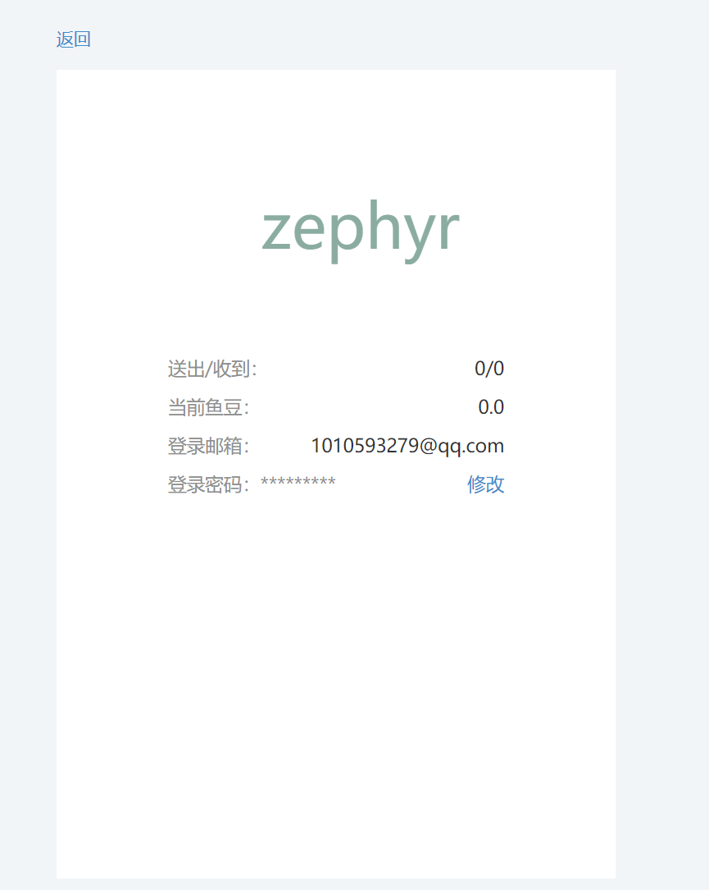

# 信息安全程序设计实践报告

## 项目简介

- 项目名称：《书海》

- 项目类型：书籍交易平台

- 作者：zephyr

- 专业：信息安全

- 项目功能：书海是一个公益性质的网站，旨在为用户提供一个平台，使他们可以将不再需要的书籍赠送给其他用户，赠送书籍可以得到一定金币，索要书籍需要消耗一部分金币。一个用户可以赠送多本书籍，一本书籍可以被多个用户索要。

  

## 项目功能

### 1.用户交互

1. **用户注册与登录**：
   - **注册**：在当今的数字化时代，为了提供个性化的体验，大多数在线平台都要求用户注册。在我平台上，新用户可以通过填写基本信息，如用户名、密码和邮箱，来创建一个新账户。这不仅确保了用户的独特身份，还为他们提供了一个私人空间，可以存储他们的偏好、心愿清单和其他相关信息。为了增加安全性和验证用户的真实性，注册过程可能还包括验证码或邮箱验证。这样，我可以确保每个注册的用户都是真实的，减少了虚假账户或机器人的可能性。
   - **登录**：一旦用户完成了注册过程，他们就可以通过输入用户名和密码来登录。登录是一个关键的步骤，因为它为用户提供了访问他们个人资料、心愿清单、赠送清单等特权功能的权限。登录过程是简单且直观的，确保用户可以轻松地进入他们的账户。
2. **个人资料管理**：
   - 在我平台上，每个用户都有自己的个人资料页面，他们可以在这里查看和编辑自己的信息。例如，他们可以更改昵称、邮箱地址或手机号码。这为用户提供了一个中心化的地方，可以管理他们的所有信息。
   - 为了使个人资料更加生动和有吸引力，用户还可以上传或更改他们的头像。这不仅增加了个性化，还使其他用户更容易识别他们。
   - 除了基本信息外，个人资料页面还为用户提供了一个查看他们的交易历史、收到的礼物、发送的心愿等的地方。这使得跟踪和管理交易变得非常简单。
3. **金币系统**：
   - 在我平台上，金币是一种虚拟货币，用户可以通过完成某些操作，如添加书籍到赠送清单，来获得金币。这种机制鼓励用户更加积极地参与，因为他们知道他们的努力会得到奖励。
   - 金币不仅仅是一种象征性的奖励。它们实际上有实际的用途。例如，用户可以使用金币来发送漂流瓶请求。这鼓励了用户之间的互动和书籍分享。
   - 为了使用户随时了解他们的金币余额，我提供了一个功能，允许他们在个人资料中查看他们的金币余额。这确保了透明度，并使用户随时知道他们的金币状态。
4. **消息与通知**：
   - 在一个活跃的社区中，沟通是关键。当有人向用户发送漂流瓶请求或当用户的心愿得到满足时，我系统会自动发送通知给用户。这确保了用户不会错过任何重要的交互或机会。
   - 为了方便用户管理他们的通知，我提供了一个消息中心，用户可以在那里查看他们的所有消息和通知历史。
   - 除了系统生成的通知外，我还允许用户之间发送私人消息。这促进了用户之间的交流，使他们能够更深入地讨论和分享他们的兴趣。
5. **搜索与浏览**：
   - 为了帮助用户找到他们感兴趣的书籍，我提供了一个强大的搜索功能。用户可以输入书籍的标题、作者或其他关键词，系统会返回与之相关的结果。这使得找到特定的书籍变得非常简单。
   - 除了搜索功能外，我还允许用户浏览其他用户的赠送清单和心愿清单。这是一个很好的方式，可以发现新的书籍或找到与自己兴趣相符的其他用户。
6. **反馈与帮助**：
   - 我非常重视用户的反馈和建议。如果用户遇到任何问题或有任何建议，他们可以通过我提供的反馈系统联系我。这为用户提供了一个直接与我沟通的渠道，确保他们的声音被听到。
   - 为了帮助新用户熟悉平台，我还提供了常见问题解答（FAQ）和帮助文档。这些资源为用户提供了详细的指导，帮助他们更好地使用我平台上的各种功能。
7. **安全与隐私**：
   - 我非常重视用户的安全和隐私。为了确保用户的所有个人信息都得到妥善保管，我采取了多重安全措施，确保这些信息不会被泄露给第三方。
   - 我允许用户设置自己的隐私权限，如是否公开自己的赠送清单、心愿清单等。这为用户提供了更多的控制权，确保他们的隐私得到尊重。
   - 为了进一步增强安全性，我可能还提供了双重验证或其他安全措施。这确保了即使用户的密码被泄露，攻击者也无法轻易进入他们的账户。

### 礼物功能 (Gift)

在我平台上，礼物功能是一个核心功能，它允许用户分享他们的书籍。这不仅仅是一个简单的分享功能，它实际上鼓励了用户之间的交互和互动。

- **我的礼物**：每个用户都有自己的赠送清单，他们可以在这里查看自己想要赠送的所有书籍。这个清单是用户与其他用户分享的主要方式，它显示了用户愿意赠送的所有书籍。
- **保存到礼物清单**：当用户决定分享一本书时，他们可以轻松地将这本书添加到自己的赠送清单中。为了确保用户不会重复添加同一本书，如果这本书已经在他们的赠送清单或心愿清单中，系统会给出提示。
- **从礼物清单中移除**：如果用户改变了主意，或者他们决定不再分享某本书，他们可以轻松地从自己的赠送清单中移除这本书。为了确保交易的完整性，如果这本书正在交易中，系统会提示用户先完成交易。

### 心愿功能 (Wish)

心愿功能是我平台上的另一个核心功能。它允许用户表达他们对某本书的兴趣，这意味着他们希望其他用户能够分享这本书。

- **我的心愿**：每个用户都有自己的心愿清单，他们可以在这里查看自己想要的所有书籍。这个清单是用户向其他用户表达他们的兴趣的主要方式。
- **保存到心愿清单**：当用户对某本书感兴趣时，他们可以轻松地将这本书添加到自己的心愿清单中。为了确保用户不会重复添加同一本书，如果这本书已经在他们的心愿清单或赠送清单中，系统会给出提示。
- **从心愿清单中移除**：如果用户改变了主意，或者他们决定不再对某本书感兴趣，他们可以轻松地从自己的心愿清单中移除这本书。

### 漂流瓶功能 (Drift)

漂流瓶功能是我平台上的核心功能之一。它允许用户之间进行书籍的交换，增加了平台的互动性。

- **发送漂流瓶**：当用户对某本书感兴趣时，他们可以向这本书的拥有者发送一个漂流瓶请求。这是一个非常直观的方式，允许用户直接与书籍的拥有者进行交互。
- **查看待处理的漂流瓶**：为了确保用户不会错过任何交互机会，我提供了一个功能，允许用户查看所有等待处理的漂流瓶请求。
- **拒绝漂流瓶请求**：如果用户决定不接受某个漂流瓶请求，他们可以轻松地拒绝它。
- **撤回漂流瓶请求**：如果用户改变了主意，他们可以撤回自己发送的漂流瓶请求。
- **标记漂流瓶为已邮寄**：为了确保交易的完整性，当用户邮寄了书籍后，他们可以标记相应的漂流瓶请求为已邮寄。

### 书籍信息

在我平台上，每本书都有一个详细的页面，显示了书籍的各种信息，如标题、作者、封面图片和ISBN。这些信息来源于Ocean，一个专业的书籍搜索引擎。这确保了我平台上的书籍信息是准确和最新的。

### 邮件通知

为了确保用户不会错过任何重要的交互或机会，我平台提供了邮件通知功能。当有人对某本书感兴趣时，系统会自动向这本书的拥有者发送一封邮件，通知他们有人对这本书感兴趣。这确保了用户始终保持与平台的连接，不会错过任何重要的机会。


# 安全方面

在数字化时代，数据安全和隐私保护已经成为了每个在线平台和应用的首要任务。对于用户来说，他们的个人信息、登录凭证和交互数据都是非常宝贵的，任何的泄露或滥用都可能导致严重的后果。因此，为了确保用户的信息安全和隐私得到充分的保护，我的系统在用户登录和邮箱通信方面采取了多重安全措施。以下是我系统中的关键安全特点的详细解析：

1. **密码哈希处理**：
   - 在现代的安全实践中，直接存储用户的明文密码是一个巨大的风险。为了避免这种风险，我的系统采用了密码哈希处理的方法。当用户首次设置或更改密码时，系统不会直接存储这个密码。而是通过`generate_password_hash`函数，将原始密码转换成一个复杂的哈希值。这个哈希值是通过一种单向算法生成的，这意味着即使有人获得了这个哈希值，他们也无法逆向工程出原始的密码。
   - 当用户尝试登录时，系统并不是简单地比较用户输入的密码和数据库中存储的密码。而是再次使用`check_password_hash`函数，将用户输入的密码转换成哈希值，然后与数据库中的哈希值进行比较。这种方法确保了即使数据库被非法访问，攻击者也无法直接获取到用户的原始密码。
2. **令牌生成与验证**：
   - 在进行某些敏感操作时，如重置密码或验证邮箱地址，仅仅依赖用户名和密码可能是不够的。为了增加安全性，您的系统引入了令牌系统。这些令牌是通过`TimedJSONWebSignatureSerializer`生成的，它使用应用的`SECRET_KEY`作为签名密钥，确保令牌的唯一性和安全性。
   - 这些令牌不仅包含了用户的信息，还有一个时间戳，确保令牌在一段时间后会自动失效。当用户使用这个令牌时，系统会验证其有效性和时效性，确保令牌没有被篡改，并且仍在有效期内。
3. **邮箱验证**：
   - 邮箱是用户的一个重要联系方式，也是重置密码或验证身份的一个关键途径。因此，确保邮箱的真实性和安全性是非常重要的。在用户进行某些操作时，系统会自动向用户的注册邮箱发送一封验证邮件。这封邮件中包含了一个特殊的链接或验证码，用户需要点击这个链接或输入验证码来完成操作。
   - 这种方法确保了只有真正掌握这个邮箱的用户才能完成操作，有效地防止了恶意攻击或身份冒充。
4. **用户会话管理**：
   - 在一个在线应用中，管理用户的会话是一个复杂但至关重要的任务。我的系统使用了`flask_login`库来简化这个过程。这个库提供了一系列的工具和方法，帮助您轻松地管理用户的登录状态和会话。
   - 例如，`@login_required`装饰器确保了只有已经登录的用户才能访问某些敏感的路由。而`UserMixin`提供了一些默认的方法，如`is_authenticated`和`is_active`，帮助您判断用户的状态和权限。
5. **异步邮件发送**：
   - 在一个高并发的应用中，直接发送邮件可能会导致应用的响应速度变慢，影响用户体验。为了解决这个问题，您的系统采用了异步邮件发送的方法。当需要发送邮件时，系统会启动一个新的线程，专门负责邮件发送的任务。这确保了主应用可以快速响应用户的请求，而不会被邮件发送的过程所阻塞。
   - 使用`Thread`来实现异步发送，确保邮件发送的过程不会影响到主应用的性能和稳定性。
6. **配置安全性**：
   - 在一个应用中，配置信息如`SECRET_KEY`和`MAIL_USERNAME`是非常敏感的。如果这些信息被泄露，可能会导致应用的安全性受到威胁。为了避免这种风险，我的应用使用了`current_app.config`来集中管理这些配置信息。这确保了这些敏感信息不会被硬编码在代码中，而是存储在一个安全的、可配置的位置。

总的来说，我的系统在用户登录和邮箱通信方面采取了多重安全措施，确保用户信息的安全性和隐私性。从密码的哈希处理到令牌的生成和验证，再到邮箱的验证和异步发送，每一步都经过了精心的设计和实现，为用户提供了一个既便捷又安全的使用环境。这些措施不仅提高了系统的安全性，也增强了用户的信任和满意度，确保了我的应用在竞争激烈的市场中脱颖而出。

## 哈希加密

**盐 (Salt)**：在密码学中，盐是随机生成的数据。当与原始密码（或其他数据）结合后，盐用于哈希函数中，以确保即使两个用户使用相同的密码，其哈希值也是不同的。盐的主要目的是防止彩虹表攻击和其他预计算的攻击手段，同时还可以防止相同密码产生相同的哈希。盐通常与哈希值一起存储，以便在验证时可以使用相同的盐重新计算哈希。

1. **我的`generate_password_hash`函数**:

   - 我设计这个函数来为密码生成一个哈希值。
   - 我使用了指定的方法和盐长度来哈希密码。
   - 我返回的哈希格式是：`method$salt$hash`。
   - 如果你选择的方法是'plain'，那么我就返回明文密码。
   - 我使用了`_hash_internal`函数来实际生成哈希。

2. **我的`_hash_internal`函数**:

   - 这是我写的一个内部函数，用于生成密码哈希。
   - 我支持明文、无盐和有盐的密码哈希。
   - 如果选择了有盐的密码，我内部使用了hmac。
   - 如果你选择的方法以'pbkdf2:'开头，那表示你想使用PBKDF2哈希。
   - 我根据你选择的方法来选择合适的哈希函数。
   - 如果你选择了PBKDF2，那么盐是必需的。
   - 如果你提供了盐，我会使用hmac来生成哈希。
   - 否则，我直接使用哈希函数来生成哈希。

3. **我的`pbkdf2_bin`函数**:

   - 我设计这个函数来返回PBKDF2哈希算法的二进制摘要。
   - 我使用你提供的盐，并迭代你指定的次数。
   - 默认情况下，我使用SHA-256作为哈希函数。
   - 如果你提供了哈希函数的名称，我会从我的`_hash_funcs`字典中获取它。
   - 如果我们处于支持`pbkdf2_hmac`的Python环境中，我会尝试使用它来优化性能。
   - 我使用hmac来生成伪随机数。
   - 对于每个块，我都会生成一个伪随机数，并与前一个块的输出进行XOR操作。
   - 最后，我返回派生的密钥。

4. **关于盐的生成**:

   - 如果你提供的盐长度小于或等于0，我会抛出一个异常。
   - 我使用系统的随机数生成器从`SALT_CHARS`中选择字符来生成盐。

   具体思维导图如下图

   

## 哈希解密

首先，我写了一个名为`check_password_hash`的函数，它的目的是验证一个密码是否与给定的哈希值匹配。

1. **我的`check_password_hash`函数**:
   - 我首先检查哈希值中的`$`字符数量，如果少于2，我直接返回`False`，因为这意味着哈希格式不正确。
   - 然后，我将哈希值拆分为方法、盐和哈希值。
   - 我使用`_hash_internal`函数重新计算密码的哈希值，并与提供的哈希值进行比较。如果它们匹配，我返回`True`，否则返回`False`。
2. **我的`safe_str_cmp`函数**:
   - 这是我用来安全地比较两个字符串的函数，确保它们的比较不会受到时间攻击的影响。
   - 我首先确保两个字符串都是字节串。
   - 然后，我检查它们的长度，如果长度不同，我返回`False`。
   - 接下来，我逐字节比较两个字符串，确保它们完全相同。
3. **我的`_hash_internal`函数**:
   - 这是我用来生成密码哈希的内部函数。
   - 我首先检查方法是否为'plain'，如果是，我直接返回明文密码。
   - 我确保密码是字节串。
   - 如果方法以'pbkdf2:'开头，我解析它以获取哈希方法和迭代次数。
   - 我根据选择的方法从`_hash_funcs`字典中获取哈希函数。
   - 如果选择了PBKDF2，我使用`pbkdf2_hex`函数生成哈希。
   - 如果提供了盐，我使用hmac生成哈希。
   - 否则，我直接使用哈希函数生成哈希。
4. **我的`pbkdf2_hex`和`pbkdf2_bin`函数**:
   - 这两个函数都是用来生成PBKDF2哈希的。
   - `pbkdf2_hex`返回十六进制编码的哈希，而`pbkdf2_bin`返回二进制哈希。
   - 我首先确定要使用的哈希函数。
   - 如果我们的Python环境支持`pbkdf2_hmac`，我会尝试使用它。
   - 否则，我使用hmac和一个伪随机函数来生成哈希。
   - 我迭代指定的次数，每次迭代都生成一个新的哈希块，并将其添加到输出缓冲区中。

具体思维导图如下


# 重置密码

我在开发一个功能，允许用户重置他们的密码。为了确保这个过程的安全性，我使用了一个特殊的方法来生成一个令牌，然后将这个令牌发送到用户的邮箱中。以下是我如何实现这个功能的：

## 1. 忘记密码请求 (`forget_password_request` 函数)

- 当用户提交他们的邮箱地址后，我首先验证这个邮箱是否存在于我们的数据库中。
- 如果邮箱有效，我会生成一个令牌，并将其发送到用户的邮箱中。
- 我使用了`send_mail`函数来发送邮件，邮件的内容包括一个链接，用户可以通过这个链接来重置他们的密码。

## 2. 令牌生成

- 我使用了`TimedJSONWebSignatureSerializer`类来生成令牌。这个类允许我创建一个带有过期时间的令牌。
- 默认情况下，令牌的有效期是3600秒（1小时）。
- 当生成令牌时，我在令牌的头部添加了两个字段：`iat`（令牌的生成时间）和`exp`（令牌的过期时间）。

## 3. JSON Web Signature (JWS)

- 我使用了`JSONWebSignatureSerializer`类来实现JWS。这个类允许我创建和验证JSON Web签名。
- 我可以使用不同的哈希算法来生成签名，例如HS256、HS384和HS512。
- 当我要验证一个令牌时，我首先检查令牌的头部中的`alg`字段，确保它与我用来生成令牌的算法匹配。

## 4. 令牌的验证

- 当用户点击邮件中的链接时，我会验证这个令牌。

- 如果令牌已经过期，我会抛出一个`SignatureExpired`异常。

- 如果令牌无效或被篡改，我会抛出一个`BadSignature`异常。

  ## 1. 什么是JSON Web？

  - JSON Web是一组标准，它定义了如何使用JSON格式来表示和传输安全信息。这组标准包括JSON Web Token (JWT)、JSON Web Signature (JWS)和JSON Web Encryption (JWE)。

  ## 2. JSON Web Token (JWT)

  - JWT是一种简短的、URL安全的令牌格式，它可以表示一组信息。这些信息被称为声明，并被编码为JSON对象。
  - JWT通常由三部分组成：头部、载荷和签名。这三部分通过点（.）分隔，并分别被Base64Url编码。

  ## 3. JSON Web Signature (JWS)

  - 为了确保JWT的完整性，我使用JWS对其进行签名。签名过程使用了一个密钥和一个哈希算法。
  - JWS可以有两种格式：紧凑序列化和JSON序列化。我通常使用紧凑序列化，因为它更简短，更适合在URL或HTTP头中传输。

  ## 4. JSON Web Encryption (JWE)

  - 除了签名，我还可以使用JWE对JWT进行加密，以确保其内容的机密性。
  - JWE使用了一系列的加密算法和技术，如密钥封装、内容加密和初始化向量。

  ## 5. 为什么我使用JSON Web？

  - **简单性**：JSON是一种轻量级的数据格式，易于阅读和编写。使用JSON表示安全信息使得整个过程变得非常简单。
  - **灵活性**：JSON Web标准支持多种哈希和加密算法，我可以根据需要选择合适的算法。
  - **跨平台**：无论我正在开发的是Web应用、移动应用还是桌面应用，JSON Web都可以很好地工作。
  - **安全性**：通过签名和加密，我可以确保数据的完整性和机密性。

思维导图如下


# cookie的加密

cookie采用base64加密，而且有效期很短，这样可以保证防止恶意攻击者来利用

# 数据库


book为数据书籍库，wish表示心愿 user是用户 gift是礼物 drift是漂流瓶

## book表设计


## user表设计


## wish表设计


## gift设计


## drift 设计


# 功能展示

## 主页面


主页面显示最近有赠送的书籍的排行，书籍越多的越靠前。

## 用户注册 登录


采用防御式编程，不允许邮箱和昵称重复，会抛出提示让用户重新输入


登录成功后回到主页


user数据库中存储了相应的数据

通过书名搜索


通过作者搜索


通过isbn搜索


赠送该书


确定赠送后结果


主页和数据库结果


向某人赠送该书的邮件


重置密码请求邮件


重置后密码发生改变


赠送清单


心愿清单


请求失败界面


漂流瓶界面（由于我没法交易 所以就没有显示）


个人主页展示



# 总结

学会封装是一件难事，开发网站是一件很综合的事情，绝大多数都是个人自学的，也希望老师以后能够优化课程设计逻辑，先教后端和http基础知识，然后熟悉了http各种请求和表单之后，再开始教css和js这些（因为这个其实是前端后期的事情），然后能在后端操作数据库之后，再考虑前后端融合，效率会大大提高。

感谢老师阅读。


# 附录

相关代码视图函数

```py
# encoding=utf-8
__author__ = 'Zephyr369'
from flask import Flask
from flask_login import LoginManager
from flask_mail import Mail
from app.models.book import db

login_manager = LoginManager()
mail = Mail()

def create_app():
    app = Flask(__name__)

    app.config.from_object('app.setting')
    app.config.from_object('app.secure')

    register_blueprint(app)

    db.init_app(app)
    db.create_all(app=app)

    login_manager.init_app(app)
    login_manager.login_view = 'web.login'
    login_manager.login_message = '请先登录或注册'
    mail.init_app(app)
    return app

def register_blueprint(app):
    from app.web import web
    app.register_blueprint(web)

```

```py
from flask import render_template

from flask import request, render_template, redirect, url_for, flash, abort
from flask_login import login_user, logout_user
from app.forms.auth import RegisterForm, LoginForm, Emailform, ResetPasswordForm
from app.models.user import User, db
from . import web

@web.route('/register', methods=['GET', 'POST'])
def register():
    form = RegisterForm(request.form)
    kk = form.validate()
    if request.method == 'POST' and form.validate():
        user = User()
        user.set_attrs(form.data)
        user.password = form.password.data
        db.session.add(user)
        db.session.commit()
        return redirect(url_for('web.login'))
    return render_template('auth/register.html', form=form)


@web.route('/login', methods=['GET', 'POST'])
def login():
    form = LoginForm(request.form)
    # print(form.data)
    if request.method == 'POST' and form.validate():
        user = User.query.filter_by(email=form.email.data).first()
        if user and user.check_password(form.password.data):
            login_user(user, remember=True)
            next = request.args.get('next')
            if not next or not next.startswith('/'):
                next = url_for('web.index')
            return redirect(next)
        else:
            flash('帐号不存在或密码错误')
    return render_template('auth/login.html', form=form)


@web.route('/reset/password', methods=['GET', 'POST'])
def forget_password_request():
    form = Emailform(request.form)
    if request.method == 'POST' and form.validate():
        account_email = form.email.data
        user = User.query.filter_by(email=account_email).first()
        from app.libs.email import send_mail
        send_mail(form.email.data, '重置你的密码', 'email/reset_password.html',
                  user=user, token=user.generate_token())
        flash('一封邮件已发送到邮箱 ' + account_email + ', 请及时查收')
        # return redirect(url_for('web.login'))
    return render_template('auth/forget_password_request.html', form=form)


@web.route('/reset/password/<token>', methods=['GET', 'POST'])
def forget_password(token):
    form = ResetPasswordForm(request.form)
    if request.method == 'POST' and form.validate():
        success = User.reset_password(token, form.password1.data)
        if success:
            flash('你的密码已更新，请使用新密码登录')
            return redirect(url_for('web.login'))
        else:
            flash('密码重置失败')
    return render_template('auth/forget_password.html', form=form)


@web.route('/change/password', methods=['GET', 'POST'])
def change_password():
    pass


@web.route('/logout')
def logout():
    logout_user()
    return redirect(url_for('web.index'))

```

```py
"""
 Created by 涓冩湀 on 2018-2-1.
"""
from flask import jsonify, request, current_app, url_for, render_template, flash
from flask_login import current_user

from app.forms.book import SearchForm
from app.models.gift import Gift
from app.models.wish import Wish
from app.view_models import book
from app.view_models.book import BookCollection, BookViewModel
import json

from app.libs.helper import is_isbn_or_key
from app.spider.ocean import Ocean
from app.view_models.trade import TradeInfo
from app.web import web


# from app.view_models.book import BookViewModel, BookCollection
# from . import web


@web.route('/book/search/', methods=['GET', 'POST'])
def search():
    """
    q: 鍏抽敭瀛� 鎴栬€� isbn
    page:
    # isbn isbn13 13涓�0鍒�9鐨勬暟瀛楃粍鎴�
    # isbn10 10涓�0鍒�9鏁板瓧缁勬垚锛屽惈鏈変竴浜� '-'
    """
    # q = request.args['q']
    # page = request.args['page']
    # args = request.args.to_dict()
    form = SearchForm(request.args)
    books = BookCollection()

    if form.validate():
        q = form.q.data.strip()
        page = form.page.data

        isbn_or_key = is_isbn_or_key(q)
        yushu_book = Ocean()

        if isbn_or_key == 'isbn':
            yushu_book.search_by_isbn(q)
        else:
            yushu_book.search_by_keyword(q, page)

        books.fill(yushu_book, q)
        # return json.dumps(books, default = lambda x : x.__dict__)
    else:
        flash('鎼滅储鐨勫叧閿瓧涓嶇鍚堣姹傦紝璇烽噸鏂拌緭鍏ュ叧閿瓧')
        # return jsonify(form.errors)
    return render_template('search_result.html', books=books, form=form)

@web.route('/book/<isbn>/detail')
def book_detail(isbn):
    has_in_gifts = False
    has_in_wishes = False

    # 鍙栦功绫嶈鎯呮暟鎹�
    yushu_book = Ocean()
    yushu_book.search_by_isbn(isbn)
    book = BookViewModel(yushu_book.first)

    if current_user.is_authenticated:
        if Gift.query.filter_by(uid=current_user.id, isbn=isbn, launched=False).first():
            has_in_gifts = True
        if Wish.query.filter_by(uid=current_user.id, isbn=isbn, launched=False).first():
            has_in_wishes = True

    trade_gifts = Gift.query.filter_by(isbn=isbn, launched=False).all()
    trade_wishes = Wish.query.filter_by(isbn=isbn, launched=False).all()

    trade_gifts_model = TradeInfo(trade_gifts)
    trade_wishes_model = TradeInfo(trade_wishes)
    pass
    return render_template('book_detail.html', book=book,
                           wishes=trade_wishes_model, gifts=trade_gifts_model,
                           has_in_wishes=has_in_wishes, has_in_gifts=has_in_gifts)


```

环境依赖

```
alembic             1.7.7
amqp                1.4.9
anyjson             0.3.3
astroid             1.5.3
autopep8            1.3.2
billiard            3.3.0.23
blinker             1.5
celery              3.1.25
certifi             2020.6.20
cffi                1.15.1
chardet             3.0.4
click               6.7
colorama            0.3.9
crypto              1.4.1
cryptography        40.0.2
cymysql             0.9.1
enum-compat         0.0.2
eventlet            0.21.0
Flask               0.10
Flask-Cache         0.13.1
Flask-Cors          2.1.0
Flask-HTTPAuth      2.7.0
Flask-Login         0.5.0
Flask-Mail          0.9.1
Flask-Migrate       1.1.0
Flask-Script        2.0.6
Flask-SQLAlchemy    2.5.1
Flask-WTF           0.14.2
greenlet            0.4.12
idna                2.5
importlib-metadata  4.8.3
importlib-resources 5.4.0
isort               4.2.15
itchat              1.3.9
itsdangerous        0.24
Jinja2              2.9.6
jwt                 1.3.1
kombu               3.0.37
lazy-object-proxy   1.3.1
Mako                1.1.6
MarkupSafe          1.0
marshmallow         3.14.1
mccabe              0.6.1
Naked               0.1.31
pip                 20.0.2
pyasn1              0.3.1
pycodestyle         2.3.1
pycparser           2.21
pylint              1.7.2
PyMySQL             1.0.2
pypng               0.0.18
PyQRCode            1.2.1
pytz                2017.2
PyYAML              3.12
qrcode              5.3
redis               2.10.5
requests            2.18.3
rsa                 3.4.2
setuptools          45.0.0
shellescape         3.4.1
six                 1.10.0
SQLAlchemy          1.4.49
typing-extensions   4.1.1
urllib3             1.22
vine                1.1.4
Werkzeug            0.12.2
wheel               0.36.2
wincertstore        0.2
wrapt               1.10.10
WTForms             2.1
zipp                3.6.0
```

